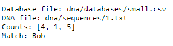
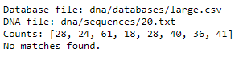

# dna-C - Who's DNA is it?

## Introduction
This program will read multiple files and given a file with a sequence of sample DNA, it will determine which person in the predetermined database the DNA sequence belongs to by comparing the Short Tandem Repeats (STRs) in the DNA sequence to the databases logged patient profiles.

## How To Run It?
1) Clone the repository and place it in the file of your choice.
2) Navigate to your favorite IDE and open up the dna.c file.
3) Run the code in your editor.
4) Follow the format below to get output based on your particular file choice.

## Questions?
Feel free to reach out to me at Munchinator6354@gmail.com with any questions/comments you may have.

## Technologies Used: 
Good 'ol "C"
